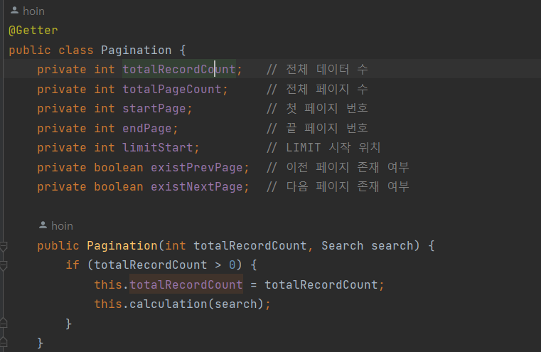

## 모든 것이 HTTP
현재 우리가 사용하는 웹과 인터넷에서는 HTTP를 빼고는 이야기 할 수 없다.
기존에는 HTTP는 Hyper Text Transfer Protocol 이라는 어원에 따라 정적인 텍스트 기반의 문서와 파일만
주고 받는 역할을 했지만 현재에는 정적 파일은 물론이고, 이미지, 영상, JSON과 같은 API 등 거의 모든 형태의 데이터를 전송가능하다.

> 결국 웹 개발자가 되기 위해서는 HTTP와 관련된 지식을 필수적으로 알아야 한다.

## 웹 서버와 WAS(Web Application Server)?
클라이언트에서 HTTP요청을 보내면 웹서버는 그 요청을 받고 그에 맞는 HTTP응답을 보내준다. (정적 리소스)
이는 단순히 웹 서버라고 생각할 수 있고 WAS는 그 과정에서 한가지를 더 수행한다.
요청에 맞는 응답을 전송하기 전에 어떤 (어플리케이션) 로직을 수행해서 조금 더 동적인 응답을 보낼 수 있게 해준다.


그럼 이 로직을 무슨 방법으로 어떻게 수행하게 할까?

## 서블릿
앞서 축약해서 HTTP 요청과 응답이라고 표현했지만 결국 클라이언트와 서버는 HTTP메시지를 통해 서로의 정보를
주고받게 된다. 그러기 위해선 서버에서는 TCP/IP 연결부터 메시지 파싱, 메시지 확인, 어플리케이션 로직 등 너무 많은 업무들을
서버에서 처리해야한다.

서블릿을 사용하면 이러한 필수적인 업무들을 많은 부분 대신 처리해준다.
(스프링은 Tomcat을 사용하여 서블릿을 지원하고 있다.)

또한 HttpServletRequest, HttpServletResponse 으로 HTTP메시지에 대한 객체를 생성하여 편리하게 사용할 수 있도록 제공하고 있다.

> 즉, WAS는 클라이언트에서 온 요청을 서블릿을 통해 메시지와 정보를 만들고 그 정보들을 응답 메시지에 담아 다시 클라이언트로 보낸다.
서블릿 컨테이너는 서블릿 객체를 생성, 초기화, 호출, 종료하는 생명주기를 관리하고 서블릿 객체는 **싱글톤**으로 관리한다.

클라이언트의 요청이 오면 이 요청을 처리하기 위한 서블릿 호출자가 필요하다. 
쓰레드가 그 역할을 하고 WAS에는 쓰레드 여러개가 대기 할 수 있는 쓰레드 풀이 있다. (적정값 필요)

## 순수 서블릿 사용 방식
기존에 사용하는 방식은 HttpServlet이라는 부모 클래스가 있고 내가 사용하고자 하는 클래스에 그 클래스를 상속받아 service라는 함수를
내가 원하는 로직으로 오버라이드 했다. 어노테이션으로 WebServlet(name, urlPatterns)를 지정하고 이를 서블릿으로 활용했다.

```java
@WebServlet(name = "helloServlet", urlPatterns = "/hello")
public class HelloServlet extends HttpServlet{
    @Override
    protected void service(HttpServletRequest req, HttpServletResponse res){
        // My Logic...
    }
}
```
### 순수 서블릿 사용 방식 - Request
>HttpServletRequest를 사용하면 HTTP메시지의 StartLine, 헤더, 바디를 편리하게 조회할 수 있다.  
(+ 임시저장소, 세션관리 기능까지)

- 요청 데이터 읽기
1. GET방식, HTML form : getParameter(), getParameterNames(), getParameterValues()를 활용
2. API(텍스트) : ServletInputStream (InputStream은 메시지 바디를 전체를 byte 코드로 반환. 반환후 UTF-8로 String으로 변환해야함)
3. API(JSON) : ObjectMapper(Jackson라이브러리) 객체 생성 후 2번과 동일하게 InputStream을 활용하여 메시지 바디와 매핑할 객체를 매핑한다.
```java
//Request - JSON API 데이터 읽기
public class RequestBodyJsonServlet extends HttpServlet {
     private ObjectMapper objectMapper = new ObjectMapper();
     
     @Override
     protected void service(HttpServletRequest request, HttpServletResponse response) throws ServletException, IOException {
        ServletInputStream inputStream = request.getInputStream();
        String messageBody = StreamUtils.copyToString(inputStream, StandardCharsets.UTF_8);
        
        HelloData helloData = objectMapper.readValue(messageBody, HelloData.class);
        
        System.out.println("helloData.username = " + helloData.getUsername());
        System.out.println("helloData.age = " + helloData.getAge());
     }
}
```
### 순수 서블릿 사용 방식 - Response
>HttpServletResponse를 사용하여 응답코드, 헤더생성, 바디생성, 쿠키, Redirect 활용가능하다.

- 응답 데이터 전달
1. HTHML 응답: response.getWriter()를 사용하여 html태그, 내용들을 직접 작성 ex) `writer.println(<div>안녕?<div>);`
2. API(JSON): ObjectMapper(Jackson라이브러리) 객체 생성 후 보내고 싶은 객체와 매핑 (writeValueAsString())
```java
//Response - JSON API 데이터 쓰기
@WebServlet(name = "responseJsonServlet", urlPatterns = "/response-json")
public class ResponseJsonServlet extends HttpServlet { 
    private ObjectMapper objectMapper = new ObjectMapper();
 
     @Override
     protected void service(HttpServletRequest request, HttpServletResponse response) throws ServletException, IOException {
     response.setHeader("content-type", "application/json");
     response.setCharacterEncoding("utf-8");
     
     HelloData data = new HelloData();
     
     data.setUsername("kim");
     data.setAge(20);
     
     String result = objectMapper.writeValueAsString(data);
     response.getWriter().write(result);
    }
}
```