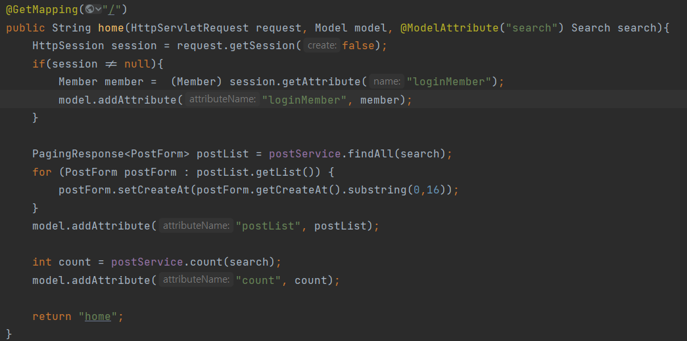

## 계기
지금까지 스프링강의를 들으면서 혼자 복습할 시간이 많이 적었던것 같다.  
어떻게 복습하면 효율적일까 생각하다가 기본적인 CRUD가 있고 구현이 어렵지 않을것 같은 선에서 내가 생각한것을 만들기로 했다.

이름은 "모두의 다이어리"  
사용자가 로그인 후 하루에 있었던 일을 일기처럼 쓸 수 있고 다른 사람들의 일기(포스트)를 볼수 있는식이다.  
~~결국 게시판만들기~~  

내가 처음으로 스프링을 통해 만드는 것이라 많이 부족하고 코드도 개선할 점이 많을 것이다. 하지만..  
## 실력 상승은 일단 부딪혀 보는 것.
목표는 기획했던 것을 구현해보는 것을 목표로 하고 시간을 들여 하나씩 리팩토링하여 개선해 나갈 것이다.

>아래는 내가 구상하면서 대충 끄적거린거...   

구현하려는 주요 기능으로는 글조회, 글쓰기, 글삭제, 로그인, 회원가입, 댓글쓰기, 글필터, 대댓글, 글수정..  
+Thymeleaf를 사용해보면서 동적화면 구성해보기.  (Thymeleaf에 대한 공부)  
~~왜 이렇게 많지?~~  
일단 게시판의 핵심기능을 위주로(글쓰기, 글조회..) 구현해보고 점차 발전시킬 예정이다.

---

## 학습목표 (큰 틀) 
1. 로그인 구현 (+로그인에 대한 공부, 세션, 쿠키, O-Auth, jwt, 소셜로그인까지 공부해보면서 점차 발전시키기)
2. 글 생성, 수정, 삭제 구현
3. Jdbc템플릿, JPA로 둘 다 구현해보기
4. 동적 화면구성(Thymeleaf)
5. h2 -> mysql로 바꾸는 연습을 해보면서 리팩토링하기

### 파이팅!!