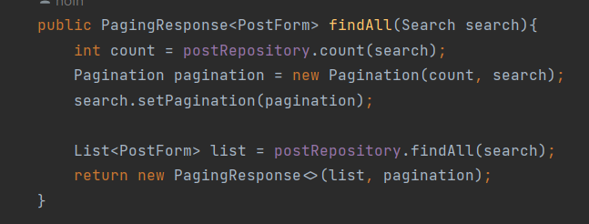
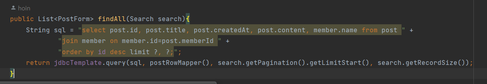

## 서론
이전 포스팅에 이어서 이번에는 글 목록을 볼 수 있는 화면에서 페이징 처리를 해봤다.  
정상적인 페이징처리를 위해서 기존에 있는 코드에 추가한 부분과 페이징을 효과적으로 처리하기위한
Class를 생성했다.

## 새로운 Class "Search"
   

Post Repository에서 쿼리문을 실행해서 데이터를 받아올때, 기존에는 PostList 즉, 글 목록을 보여주기위한
실질적인 post데이터만 들고왔다.   

지금부터는 페이징 처리를 위해 페이지 번호를 파라미터로 전달받아 로직을 처리한 후 view처리를 하기위해 Search클래스를 추가하였다.
보여줄 글 목록의 개수는 10개, 시작 페이지는 page=1, 페이징을 위한 페이지 개수는 10개이므로 초기화를 위해 생성자주입을 활용했다.  

여기서 getOffset method같은 경우는 후에 repository의 쿼리문에 limit을 사용하기 위한 메소드이다.

limit 1, 10 -> 인덱스 1번부터 10개 데이터, limit 11, 10 -> 10번부터 10개의 데이터를 가져온다.

## 새로운 Class "Pagination"
   

이전 Search 객체에서 필드명으로 pagination이 궁금했을것같다. pagination 클래스를 따로 생성해서 search 객체의 필드로 가질수 있게 했는데,
이 pagination의 역할은 전체 페이징을 위한 역할을 하게된다. 따라서 페이징을 위한 전체 데이터 개수, 전체 페이지수, 첫페이지 번호, 끝페이지 번호, 이전페이지 존재여부, 다음페이지 존재여부를 
필드로 가져 효율적인 페이징 처리를 위해 객체로 생성하였다.

Search 객체와 Pagination 객체의 차이점은 Search객체는 현재 페이지를 중점으로 로직을 처리하고 Pagination 객체는 페이징 전체를 위해
페이지 목록에 중점을 맞춰 로직을 처리한다.

## HomeConrtoller

새로운 객체를 생성함에 따라 우리의 Controller도 수정을 해주어야 한다.  우선 우리의 페이지 번호를 파라미터로 전달받기 때문에
전달받은 파라미터를 사용하기 위해 @ModelAttribute 어노테이션을 이용해 Search 객체와 매핑시킨다.
또한 전달받은 search를 사용하기 위해 postService의 인자로 전달받은 search를 넘길 수 있게 해준다. 

## PostService

Search 객체를 인자로 전달받았으므로 Service의 코드도 수정해주자. 
이전 포스팅과 Service 부분이 많이 다를텐데 이는 우리가 repository에서 가져온 postList 뿐만 아니라
페이지와 관련된 데이터인 pagination객체를 가져오기 위함이다.  
앞선 pagination 부분에서 pagination의 초기화 부분인 생성자를 보자.   
우리는 pagination을 생성하기 위해 전체 포스트데이터개수와 search 객체를 인자로 넣어주어야한다.
search객체는 우리가 get 파라미터로 받았기 때문에 문제가 없고, totalRecordCount는 repository에서 계산 한 이후에 알 수 있기 때문에
service부분에서 return 타입을 포스트데이터와 페이징데이터를 둘다 받을 수 있도록 pagingRespose 객체로 받도록 했다.

## 새로운 Class "PagingResponse"

앞서 서비스단에서 말했다시피 우리는 포스트데이터를 List형식으로 받아오고 pagination정보를 받아오도록 하기 위해 
PagingResponse를 생성했다. (자바의 제네릭이용)

## PostRepository

Repository 부분은 크게 다를 것은 없고 "order by id desc limit ?, ?"부분만 보면 될듯싶다.   
우리는 최근 생성된 포스트부터 목록을 보여줄것이기 때문에 order by desc를 사용했고 몇번째 데이터부터 몇개를 보여줄건지에 대한 문법으로
limit를 사용했다.

## 현재까지 진행상태 😊

하단의 페이지 번호가 보인다..!!

## 3번 페이지를 눌렀을 때 (URL확인, 글번호 확인)

## page번호가 10번이 넘어가면 "이전" 버튼이 생긴다

> 이번 포스팅 진행과정중에도 Controller, Service, Repository의 코드를 만지는 시간보다
> thymeleaf를 이용해 view작업을 하는 시간이 오래걸렸다...   
> thymeleaf를 사용하여 view작업을 처리하는게 생각보다 쉽지않다는걸 다시한번 깨닫는 시간이었다..

다음 포스팅에 계속..!