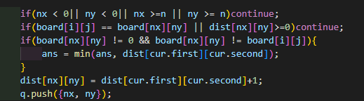

섬으로 이루어진 나라들 사이의 가장 짧은 다리 1개를 만드는 문제!
```
//입력으로 주어지는 형식
10
1 1 1 0 0 0 0 1 1 1
1 1 1 1 0 0 0 0 1 1
1 0 1 1 0 0 0 0 1 1
0 0 1 1 1 0 0 0 0 1
0 0 0 1 0 0 0 0 0 1
0 0 0 0 0 0 0 0 0 1
0 0 0 0 0 0 0 0 0 0
0 0 0 0 1 1 0 0 0 0
0 0 0 0 1 1 1 0 0 0
0 0 0 0 0 0 0 0 0 0
```
각각의 1은 육지를 나타내고 1이 이어져있으면 1개의 섬으로 본다.  

따라서 각각의 섬에서부터 다른 섬으로의 최단 거리를 계산하기 위해서 섬마다의 번호를 달리 부여했다.  

첫 bfs를 이용해서 섬의 id를 나타내기 위해 각 섬별로 숫자를 다르게 부여했고
두번째 bfs를 이용해서 각 섬에서부터 다른 섬까지의 거리를 계산했다.

두번째 bfs 사용시 주의점으로는 예외처리를 확실해 했어야 했는데  
  
이 부분이 문제의 핵심이었던 것 같다.
즉, 섬이 같거나 거리를 계산한 적이 있으면 continue를 하고 
바다가 아니면서 시작한 섬과 도착한 섬이 다른 섬이라면 로직을 수행한다. 

bfs를 두번 사용해서 푼 문제이다.

```c++
#include <bits/stdc++.h>
using namespace std;

int n;
int ans = 201;
int board[101][101];
bool vis[101][101];
int dist[101][101];

int dx[] = {1, 0, -1, 0};
int dy[] = {0, 1, 0, -1};

int main(){
    cin>>n;
    for(int i=0; i<n; i++){
        for(int j=0; j<n; j++){
            cin>>board[i][j];
        }
    }

    int cnt = 0;
    queue<pair<int, int>> q;
    //각 육지별로 숫자 다르게 부여
    for(int i=0; i<n; i++){
        for(int j=0; j<n; j++){
            if(board[i][j] == 1 && vis[i][j]==0){
                cnt++;
                vis[i][j] = true;
                board[i][j] = cnt;
                q.push({i, j});
                while(!q.empty()){
                    auto cur = q.front();
                    q.pop();
                    for(int dir = 0; dir < 4; dir++){
                        int nx = cur.first + dx[dir];
                        int ny = cur.second + dy[dir];

                        if(nx < 0|| ny < 0|| nx >=n || ny >= n)continue;
                        if(vis[nx][ny] || board[nx][ny]==0)continue;
                        board[nx][ny] = cnt;
                        vis[nx][ny] = 1;
                        q.push({nx, ny});
                    }
                }
            }
        }
    }

    //dist배열을 -1로 초기화
    for(int i=0; i<n; i++) fill(dist[i], dist[i]+n, -1);

    for(int i=0; i<n; i++){
        for(int j=0; j<n; j++){
            if(board[i][j] != 0){
                q.push({i, j});
                dist[i][j] = 0;

                while(!q.empty()){
                    auto cur = q.front();
                    q.pop();

                    for(int dir =0; dir<4; dir++){
                        int nx = cur.first + dx[dir];
                        int ny = cur.second + dy[dir];

                        if(nx < 0|| ny < 0|| nx >=n || ny >= n)continue;
                        if(board[i][j] == board[nx][ny] || dist[nx][ny]>=0)continue;
                        if(board[nx][ny] != 0 && board[nx][ny] != board[i][j]){
                            ans = min(ans, dist[cur.first][cur.second]);
                        }
                        dist[nx][ny] = dist[cur.first][cur.second]+1;
                        q.push({nx, ny});
                    }
                }
                for(int i=0; i<n; i++) fill(dist[i], dist[i]+n, -1);
            }
        }
    }
    cout<<ans;
}
```
